<div align="center">

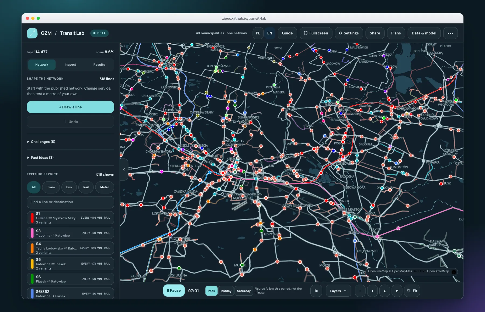

# Transit Lab

**A public transport sandbox for the Upper Silesian metropolis.**<br>
Edit real lines, draw a metro through the real city, and see what it does to the network.

[**Open the live app**](https://zipos.github.io/transit-lab/) · English and Polish · light and dark · phone and desktop · no account, no backend

</div>

Transit Lab loads the published timetables of 43 municipalities (GZM, plus Jaworzno and Orzesze) and the 2021 census grid. You change the service, and a model re-estimates trips, waiting time, journey time and crowding within seconds. Everything runs in your browser. Your plans stay in your browser too, and a link can carry one to someone else.

> Passenger counts, satisfaction and cost are **scenario estimates**, not observed ridership or a forecast. [How far to trust them](#model-limits-and-roadmap).

## Try it in one minute

1. Open the [live app](https://zipos.github.io/transit-lab/). A five-step tour starts on your first visit.
2. Search for **T6** in the line list, select it, and set its interval to **6 minutes**.
3. Press **+ Draw a line**, click five stations from Katowice to Sosnowiec, then **Open line**.
4. Open **Results** and compare the numbers with the published network.

---

## Explore the project

Each section below opens on click. Start at the top and go as deep as you like.

<details>
<summary><b>1 · What you can do</b></summary>

<br>

<details>
<summary><b>See the whole network</b> — every bus, tram and rail pattern, with moving vehicles</summary>

<br>


The map shows 978 directional patterns and 7,233 stops, drawn on an OpenFreeMap basemap. Press **Play** to animate vehicles along their routes. The clock can show **Peak**, **Midday** or **Saturday**; the figures follow the period you choose, not the minute on the clock.

Zoomed out, the app does not draw every vehicle. It keeps a stable random sample, so every part of the network shows the same share of its fleet, and zooming in raises that share until you see all of them:

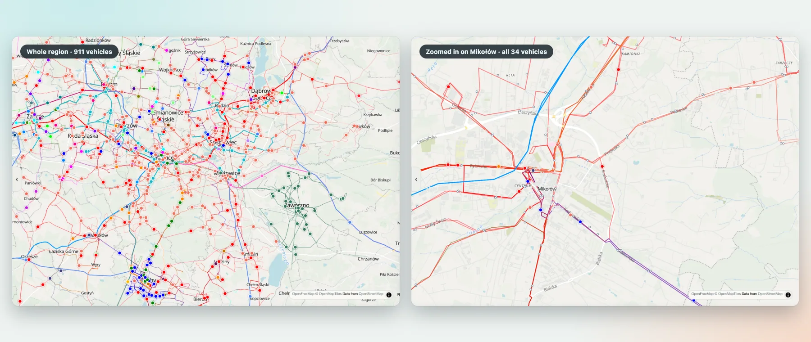

The **Layers** menu hides whole modes (tram, bus, rail, metro) to reduce clutter without changing the network.

</details>

<details>
<summary><b>Change a line</b> — interval, stops, on or off</summary>

<br>

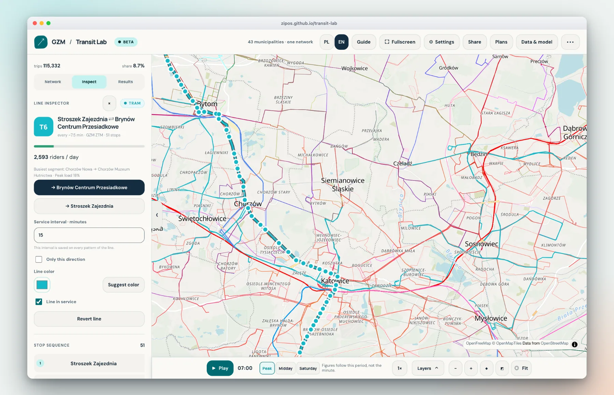

Select any line on the map or in the list. The inspector shows daily riders, the busiest segment and the peak load, and lets you:

- change the **service interval** (applied to every variant of the line, or only to one direction),
- switch the line **on or off**, recolor it, and add, remove or reorder stops,
- **revert** a published line to its source timetable, or delete a line you drew.

Each edit re-runs the model. The Results panel then shows the change against the published network, and **Undo** steps back one edit at a time.

</details>

<details>
<summary><b>Draw a metro</b> — click stations onto the map</summary>

<br>

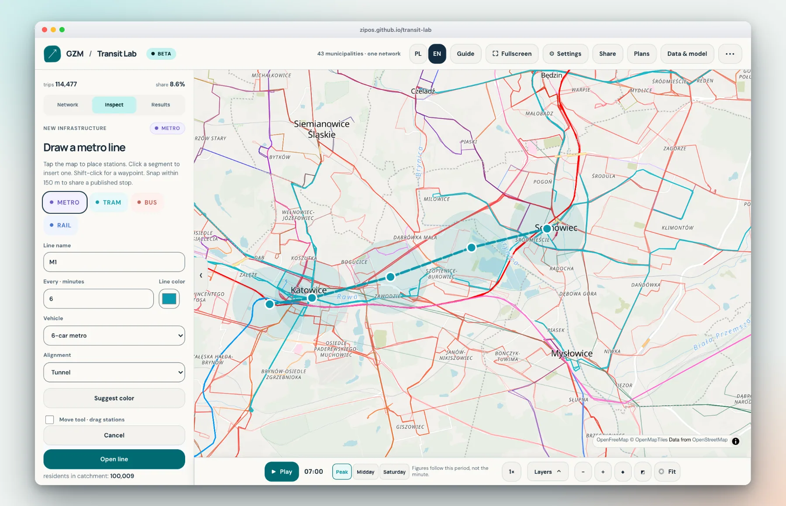

Choose a mode (metro, tram, bus or rail), click to place stations, and the panel reports in real time how many residents live within 800 m and how many are **newly** within 800 m of rapid transit. Stations snap to published stops within 150 m. You can also set the vehicle, the alignment (tunnel, elevated, street level…), make the line a ring, or drag stations to move them. On a phone, press and hold a station to move it.

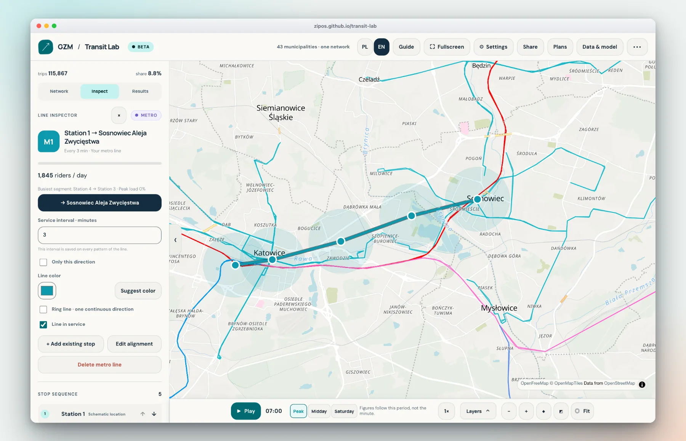

Press **Open line** and the new line joins the network like any other: it has riders per day, a busiest segment and its own interval. New lines use straight segments between stations. They do not follow roads or engineered tunnel alignments.

You can also load one of three **historical proposals** from the 2018 GZM metropolitan-rail concept as an editable draft.

</details>

<details>
<summary><b>Read the results</b> — trips, wait, journey, crowding, local impact</summary>

<br>

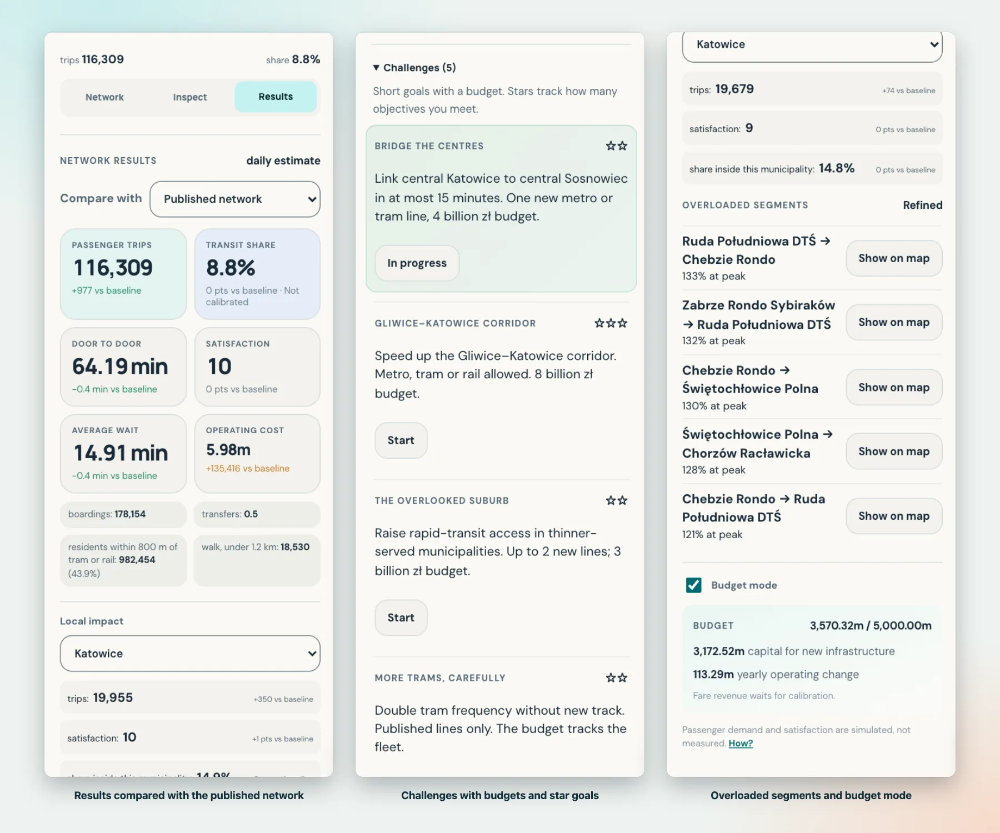

The **Results** tab compares your scenario with the published network (or with any saved plan) and shows passenger trips, transit share, door-to-door time, satisfaction, average wait and operating cost. **Local impact** zooms in on one municipality. **Overloaded segments** lists where a vehicle would exceed its capacity at the peak, with a button that shows each one on the map.

</details>

<details>
<summary><b>Look at the map differently</b> — five planning layers</summary>

<br>

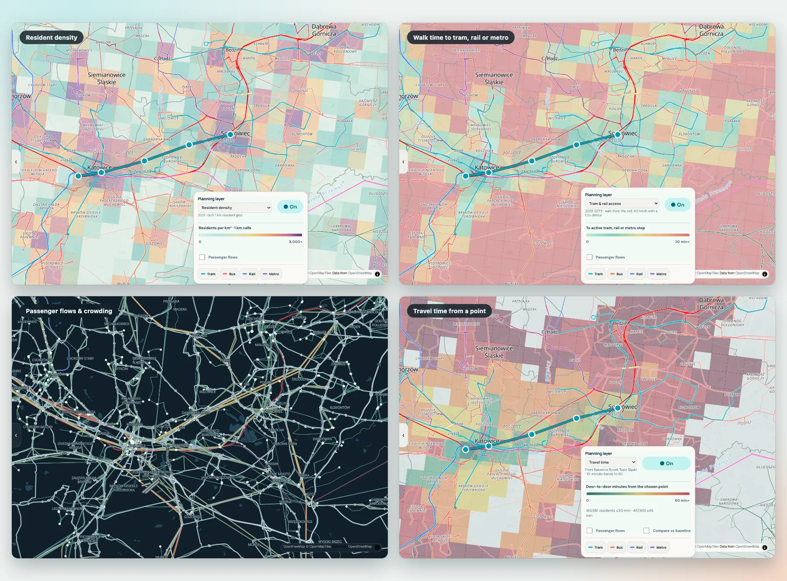

| Layer | What it shows |
| --- | --- |
| **Resident density** | The 2021 census grid, 1 km cells, residents per km². |
| **Tram and rail access** | Walking minutes from each cell to the nearest tram, rail or metro stop that runs in the selected period. |
| **Passenger flows** | Daily riders per segment, with an optional crowding colour (volume over capacity). |
| **Travel time** | Right-click the map, or press the button on a stop, to colour every cell by door-to-door minutes from that point. |
| **Winners and losers** | The change in destination attraction each cell can reach within 45 generalized minutes, compared with a baseline. |

</details>

<details>
<summary><b>Take a challenge, or set a budget</b></summary>

<br>

Five short challenges set a goal, a budget and the allowed modes — for example *Bridge the centres* (link Katowice and Sosnowiec in 15 minutes with one new line) or *Cheap coverage*. Stars count how many objectives you meet.

Optional **Budget mode** adds planning-level capital and fleet costs, with a source for every figure in [`docs/model-parameters.md`](docs/model-parameters.md). It shows capital spent against the budget, the yearly change in operating cost and the capital cost per new daily rider. Fare revenue stays hidden until boardings are calibrated.

</details>

<details>
<summary><b>Share, save and compare</b></summary>

<br>

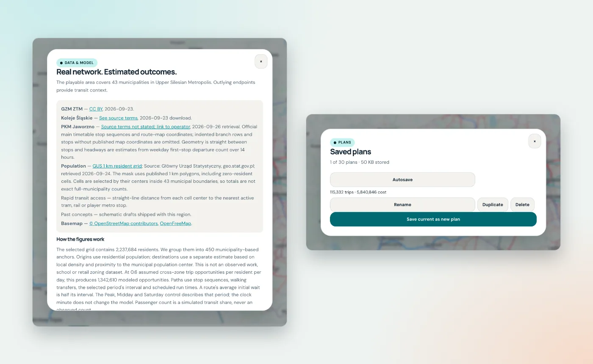

- **Plans** keeps up to 30 named plans in your browser, and any plan can be the comparison baseline.
- **Share** copies a link that contains your whole scenario, compressed into the URL. There is no server and no upload.
- **Export** and **Import** move a scenario as a JSON file; earlier eight-city, five-city and three-city saves still load.
- **Data and model** explains every source and the method inside the app.

</details>

<details>
<summary><b>Phones, two languages, light and dark</b></summary>

<br>

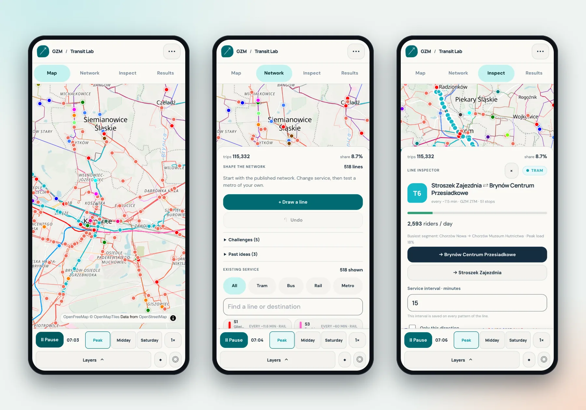

On a phone the side panels become tabs (**Map**, **Network**, **Inspect**, **Results**) and the controls fit in a two-row bar. The panels follow the system light or dark setting, while the map stays light unless you change **Settings → Map style** to dark or to follow the system, because dense networks read more clearly on a light basemap. The language follows your browser: Polish when it starts with `pl`, English otherwise. You can switch at any time with **PL / EN**.

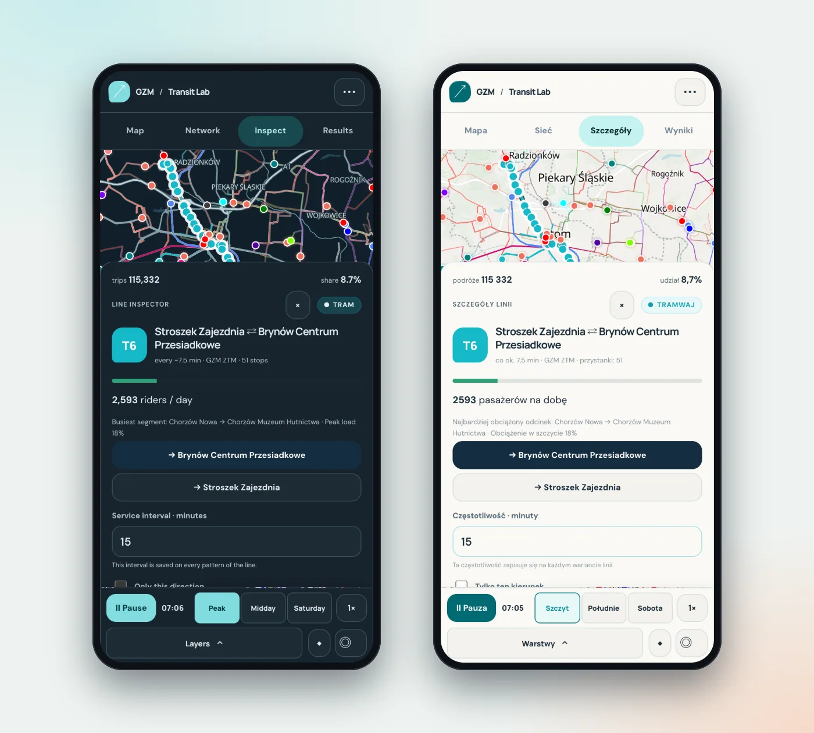

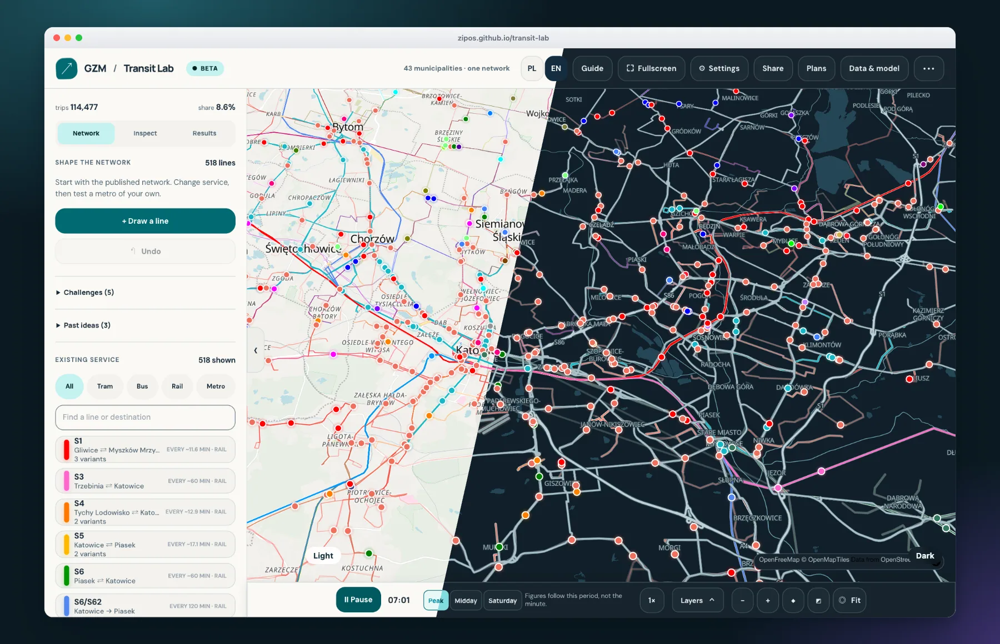

</details>

<details>
<summary><b>The first-run tour</b></summary>

<br>

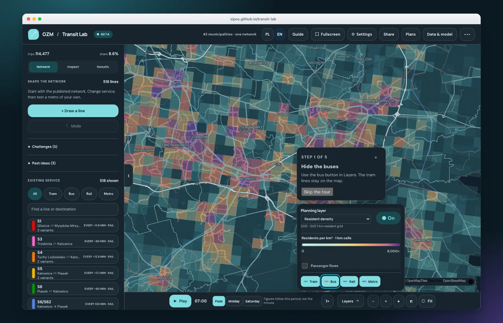

A five-step coach walks through hiding the buses, selecting T6, changing its interval, drawing a metro and reading the result. Each step moves on when you do the thing (the metro step can be skipped). **Settings** can show it again.

</details>

</details>

<details>
<summary><b>2 · How it works</b></summary>

<br>

Transit Lab is a static site: plain HTML, CSS and ES modules, no framework and no build step. Python scripts turn open data into the JSON files the app loads, and those files are committed. The browser does the rest.

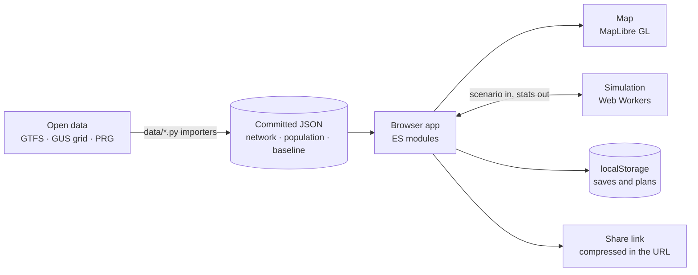

<details>
<summary><b>The data pipeline</b></summary>

<br>

| Step | Script | Output |
| --- | --- | --- |
| Fetch pinned sources | `data/fetch_sources.py` | Raw feeds (not committed), each checked against a SHA-256 pin in `data/sources.json` |
| Population | `data/import_population.py` | 1 km resident grid and municipal boundaries |
| Timetables | `data/import_gtfs.py`, `data/import_pkm.py` | Directional patterns, stops, scheduled run times |
| Assemble a region | `data/build_region.py gzm` | `data/gzm/network.json`, `population.json` and `manifest.lock.json` |
| Baseline | `tools/build-baseline.mjs gzm` | `data/gzm/baseline.json`, the shipped peak result |

`manifest.lock.json` records the hash of the network, population and proposals files, so the browser can tell a stale cached file from a current one. The fetcher never silently adopts changed bytes: a changed file fails the check until you accept it with `--accept-new`.

A region is a folder of data plus a `regions/<id>/region.json` manifest (map centre, municipalities, feed labels, demand and budget settings). GZM is the only region today; the roadmap covers Warsaw and other cities.

</details>

<details>
<summary><b>The simulation model</b></summary>

<br>

The model is deterministic and lives in `src/sim/model.js`. It estimates, for a typical weekday period, how many people would choose transit over a car, and how long each journey takes.

<details>
<summary>Demand: where people start and finish</summary>

<br>

The census grid holds **2,237,684 residents** in 2,798 cells of 1 km². The importer merges those cells into **450 demand zones**: a cell with at least 5,000 residents stays its own zone, and smaller ones merge with a neighbour in the same municipality. Residents set where trips **start**. Where they **end** is a proxy built from local density and closeness to the municipal centre, because no workplace, school or shop data is used. A game assumption of 0.6 cross-zone trip opportunities per resident per day gives about **1.34 million** possible trips.

</details>

<details>
<summary>Routing: the fastest way by transit</summary>

<br>

For every origin zone, the model runs a shortest-path search over a layered graph of stops: *not yet boarded*, *on a pattern*, *after alighting*, *after a walking transfer*. Because the layers carry the state, every edge has a fixed cost and the search stays exact. Between two boardings a rider can make one walk of up to 340 m.

The search minimises **generalized cost**, in minutes:

`in-vehicle time + 2 × walking + 1.5 × waiting + 5 × transfers + boarding and alighting`

Waiting is half the interval up to 10 minutes. For longer intervals, riders time their arrival, so waiting grows slowly. This is a frequency model, not a timetable router: it uses the selected period's interval and the scheduled run times, not a departure clock.

</details>

<details>
<summary>Choice: transit or car</summary>

<br>

Each trip also gets a car alternative: straight distance × 1.35, at 18, 26 or 40 km/h depending on how dense the two ends are, plus access and a parking penalty. A logit compares the two costs. Trips shorter than 1.2 km count as walking and stay out of the share.

The boarding constant is fixed at **0**, so the transit share is **deliberately not calibrated** to a ridership count, and the interface says so. *Satisfaction* is `50 + 50 × tanh((car cost − transit cost) / 20)`, averaged over riders. It is an index, not a survey.

</details>

<details>
<summary>Flows and crowding</summary>

<br>

Assigned trips become daily flows on every segment. Capacity comes from each vehicle's seats plus standing room at 4 people per m²: a 12 m bus carries 68, a 30 m tram 180, a three-car rail unit 356, a six-car metro 996. Peak-hour flow is 10% of the day. Overloaded segments get a crowding penalty, and the assignment runs two more times, averaging the flows each time. The panel shows **Refining** while this happens and **Refined** when it finishes. Crowding only reshapes the flows: the headline trips, wait and satisfaction come from the first, uncrowded pass, so they stay comparable with the baseline.

</details>

<details>
<summary>Where every number comes from</summary>

<br>

[`docs/model-parameters.md`](docs/model-parameters.md) gives every parameter with its value, status (sourced or assumption) and rationale, plus the plausibility check against the 2018 household survey. [`docs/decisions/31-cost-sources.md`](docs/decisions/31-cost-sources.md) records each capital and fleet cost, where sources disagree and what stays unset.

</details>

<details>
<summary>Speed</summary>

<br>

A full recalculation is about **3 s** single-threaded in Node on an Apple-silicon Mac (`node tests/bench-sim.mjs`). In the browser the origin zones are split across up to four Web Workers (one on phones and on devices with 4 GB or less), edits are debounced, and a result that has been overtaken by a newer edit is dropped. A progress bar shows while it runs. The published peak result ships precomputed, so the first screen needs no calculation.

</details>

</details>

<details>
<summary><b>The map</b></summary>

<br>

The map is [MapLibre GL JS](https://maplibre.org/), vendored in `vendor/`, over OpenFreeMap tiles. The app adds its own sources and layers: the density and planning grids, route halos and lines, stops, flow bands, the selected line, the draft line, the ruler and the vehicles. They are all defined in `src/main.js` (`addLayers`), and the zoom-dependent expressions live in `src/layers.js`.

Vehicle dots are illustrative. For every route in view the app places one to eight vehicles along its shape (more for a shorter interval or a longer route), moved by the simulated clock. If there are more than about 900 (250 on phones), player-drawn lines always keep theirs, and the published network keeps a stable hash-ranked sample, so zooming in shows more of it, never a different set.

</details>

<details>
<summary><b>Scenarios, sharing and safety</b></summary>

<br>

A scenario is three things: `overrides` (edits to published lines, keyed by line id), `customRoutes` (lines you drew) and `customStops` (stations you placed). Everything else — the network, the population — is the same for everyone.

- **Share links** minify the scenario, compress it with the browser's `deflate-raw` stream and put it in the URL hash (`#s=…`). The hash never reaches a server. Links over 8,000 characters are flagged, and exporting a file is suggested instead.
- **Imports are validated** on the way in: at most 200 custom routes, 5,000 custom stops and 300 stops per line, a 5 MB file limit, line ids and colours matched against a strict pattern, only `http` and `https` links, and headways clamped. A hostile file cannot inject markup or crash the app (`tests/scenario-audit.cjs` checks this against a malicious fixture).
- **Saves** live in `localStorage` under `transit-lab:<region>:…`, with an autosave and up to 30 named plans. Old network versions are listed so earlier saves still load or are migrated with a visible message.

</details>

<details>
<summary><b>Two languages</b></summary>

<br>

All interface text is in `src/i18n/locales/en.json` and `pl.json`. Elements carry `data-i18n` attributes, code calls `t()`, and counts use `plural()`, which relies on `Intl.PluralRules` because Polish has three plural forms. Regional data (line concepts, challenges, municipality names) carries `{ "pl": …, "en": … }` pairs. Where a Polish sentence would need a different noun form for each number, the label comes first (`podróże 114 477`) instead of after it.

[`docs/i18n-review.md`](docs/i18n-review.md) lists the Polish strings worth a native speaker's second read.

</details>

<details>
<summary><b>Where things live</b></summary>

<br>

| Path | What is in it |
| --- | --- |
| `index.html`, `styles.css` | The whole interface shell |
| `src/main.js` | App wiring: map, panels, tools, workers |
| `src/sim/` | The model, the worker, parameters and budget costs |
| `src/ui/` | The line list, inspectors, draft panel, results and dialogs |
| `src/layers.js` | Flow, travel-time and route styling for the map |
| `src/scenario.js`, `share.js`, `slots.js` | Validation, share links, saved plans |
| `src/i18n/` | The two catalogs and the `t()` / `plural()` helpers |
| `regions/<id>/` | Region manifest, historical proposals and challenges |
| `data/` | Importers, pinned source list and the committed processed data |
| `tests/` | Audits and the browser smoke test |
| `tools/` | The baseline builder and the screenshot generator |
| `deploy/` | Runbook and config for self-hosting |
| `docs/` | Model notes, decisions, roadmap briefs and these screenshots |

</details>

</details>

<details>
<summary><b>3 · Run it and work on it</b></summary>

<br>

### Run locally

```bash
python3 -m http.server 8765
```

Open [localhost:8765](http://localhost:8765). On Windows, use `py -m http.server 8765`. The processed snapshots are committed, so playing needs no data download or build step. OpenFreeMap basemap tiles need internet access. Opening the HTML file directly (`file://`) does not work, because the app fetches each region's JSON. Add `?debug=1` to the address to expose `window.__DEBUG__` (the map, source counts, vehicle count and frame time) for the browser console.

Changes save in the browser's local storage. **Export** and **Import** move scenario JSON between browsers. Use Undo and Reset to manage experiments.

<details>
<summary><b>Rebuild the data</b></summary>

<br>

`python3 data/build_region.py gzm` rebuilds `data/gzm/network.json` from the pinned sources and writes `data/gzm/manifest.lock.json`. To reproduce the data with Python's standard library, fetch the raw inputs before running the importers:

```bash
python3 data/fetch_sources.py
python3 data/import_population.py
python3 data/import_gtfs.py
```

[data/sources.json](data/sources.json) records source URLs, SHA-256 pins, dates and terms. The fetcher verifies existing files as well as downloads, and never silently adopts changed bytes. Publishers rotate feeds; where available, the original public Git history supplies the pinned archive. PKM's JSON is generated by our scraper: `python3 data/import_pkm.py` regenerates it from the current timetable. Explicitly adopt refreshed files with `python3 data/fetch_sources.py --accept-new`; this updates their hashes and retrieval dates and may change rebuilt results. Preserve local pinned copies to reproduce the original snapshot. Raw inputs are ignored in the current tree; earlier public commits still contain them.

After the network or the model changes, regenerate the shipped peak result with `node tools/build-baseline.mjs gzm`.

</details>

<details>
<summary><b>Run the tests</b></summary>

<br>

```bash
node tests/simulation-audit.cjs     # model invariants
node tests/scenario-audit.cjs       # import validation, malicious fixture
node tests/layers-audit.mjs         # flow bands, travel-time maps
node tests/zoom-expressions-audit.mjs   # map style expressions MapLibre accepts
node tests/i18n-plural.mjs          # Polish and English plural forms
python3 tests/pkm-import-audit.py
```

There is one audit per feature (lines, share links, revisions, zones, flows, builder, budget, challenges), all listed in [`.github/workflows/ci.yml`](.github/workflows/ci.yml), which also runs a Playwright smoke test in a real browser. The PKM importer audit requires the raw PKM snapshot; the Node audits use committed processed data.

The zoom-expression audit exists because MapLibre drops a layer whose style expression is invalid and only logs an event, which once made every route line disappear without an error.

</details>

<details>
<summary><b>Regenerate the screenshots</b></summary>

<br>

The images in this README come from the real app, driven by Playwright. They need `cwebp` (from libwebp) and a one-time browser download:

```bash
cd tools/screenshots
npm install && npx playwright install chromium
node index.mjs                  # capture everything, then compose
node index.mjs capture edit     # re-take one capture
node index.mjs compose hero     # re-compose one image
```

`capture.mjs` holds one job per scene (it opens the app, hides layers that would clutter the shot, and saves raw screenshots), and `compose.mjs` turns them into the framed, side-by-side and phone-mockup images in `docs/screenshots/`. Set `CHROME_PATH` to use a Chromium you already have.

</details>

<details>
<summary><b>Deploy it</b></summary>

<br>

Every push to `main` publishes the static app to GitHub Pages ([`pages.yml`](.github/workflows/pages.yml)). To host it yourself, [`deploy/README.md`](deploy/README.md) is a runbook for a small Debian LXC on Proxmox, with Caddy serving the files and a Cloudflare Tunnel in front, plus a systemd timer that re-publishes from Git.

</details>

<details>
<summary><b>Roadmap and conventions</b></summary>

<br>

The [roadmap](docs/roadmap/) holds the self-contained task briefs behind the project, with the decisions already made, the order and dependencies, and the rules each change follows: no build step, never invent data, keep saves working, verify on desktop light, desktop dark and a phone width.

</details>

</details>

<details>
<summary><b>4 · Data sources and attribution</b></summary>

<br>

The 23 September 2026 metropolitan snapshot (`2026-09-23-gzm-v5`) has **978 directional patterns and 7,233 stops**: GZM contributes 888, Koleje Śląskie 44, and PKM Jaworzno 46. The **2021 GUS resident grid** contains **2,798 selected 1 km cells**, including 677 empty cells, and **2,237,684 residents** across 43 municipalities. Passenger stops come from GTFS pickup and drop-off rules, so fare-zone markers and technical stops are not in the network. Koleje Śląskie keeps every short turn with at least two weekday trips. GZM and Koleje Śląskie intervals are the Wednesday 06:00–09:00 headway; PKM Jaworzno intervals remain estimates from its public timetable. The basemap can change independently of the pinned service data.

Orzesze is outside GZM membership, but appears in the published GZM and regional rail feeds.

Sources:

- [GZM ZTM extended GTFS](https://otwartedane.metropoliagzm.pl/dataset/rozklady-jazdy-i-lokalizacja-przystankow-gtfs-wersja-rozszerzona), publisher snapshot `schedule_ZTM_2026.09.23_11277_0005`, CC BY.
- [Koleje Śląskie GTFS](https://koleje-ks.pl/gtfs/2025-2026.zip), 2025–2026 feed downloaded 23 September 2026. [Transitland catalog](https://www.transit.land/feeds/f-u2v-koleje~slaskie) records CC0; the operator download page does not state a license.
- [PKM Jaworzno official timetables](https://www.pkm.jaworzno.pl/rozklady/start.php), pinned timetable and route-map snapshot retrieved 26 September 2026. The site does not state a reusable feed license. `data/import_pkm.py` refreshes the snapshot; run `python3 data/fetch_sources.py --accept-new` deliberately when refreshing it.
- [GUS NSP 2021 resident grid](https://portal.geo.stat.gov.pl/aktualnosci/dane-o-rezydentach-w-siatce-kilometrowej-nsp-2021-mozliwe-do-pobrania/), source: Główny Urząd Statystyczny, geo.stat.gov.pl, retrieved 24 September 2026. ATOM metadata reports no use conditions; [portal terms](https://portal.geo.stat.gov.pl/regulamin/) require source and retrieval-date attribution. No named CC license is stated.
- [GUGiK National Register of Boundaries (PRG)](https://www.geoportal.gov.pl/pl/dane/panstwowy-rejestr-granic-prg/), pinned municipal boundaries retrieved 25 September 2026.
- [GUS BDL P4610](https://bdl.stat.gov.pl/bdl/dane/podgrup/temat/40/403/4610), archived December 2025 municipality-wide wage input; no longer shown in the game.
- [2018 GZM metropolitan-rail concept](https://bip.metropoliagzm.pl/attachments/download/189291), source for three historical editable line drafts. These are planning concepts, not approved alignments.
- Basemap: [© OpenStreetMap contributors](https://www.openstreetmap.org/copyright), served by [OpenFreeMap](https://openfreemap.org/). MapLibre GL JS is bundled with its license in `vendor/LICENSE-maplibre.txt`.

The [zbiorkom.live GZM mirror](https://cdn.zbiorkom.live/gtfs/gzm.zip) was reviewed; the baseline uses original publisher feeds and does not depend on its API.

See [ATTRIBUTION.md](ATTRIBUTION.md) for source terms and attribution text. Koleje Śląskie and PKM Jaworzno are **published by the owner's decision on 27 September 2026, terms still unclear**.

</details>

## Model limits and roadmap

Passenger counts, satisfaction, cost, load and vehicle motion are scenario estimates. See [model limits](docs/model-limits.md) for assumptions and remaining risks, and the [roadmap](docs/roadmap/) for planned work.

The shipped **peak baseline** (model version 4) models **115,332 passenger trips per day**, a **transit share of 8.7%** among trips longer than 1.2 km, an average wait of **15.3 min**, an average door-to-door journey of **64.6 min** and a satisfaction index of **10**. It is not observed ridership or a calibration target. The 2018 household survey for the central subregion of Silesia puts transit near 23.5% of non-walk trips; the gap is expected, because the boarding constant is left at 0 on purpose and destinations are still a proxy. [`docs/model-parameters.md`](docs/model-parameters.md) has the comparison and the reasoning.

## License

The code in this repository is licensed under the [GNU Affero General Public License v3.0](LICENSE). Copyright (C) 2026 zipos.

Transit feeds, population grids, and boundary data keep the terms of their publishers, listed above. The AGPL applies to the code, not to those datasets.
